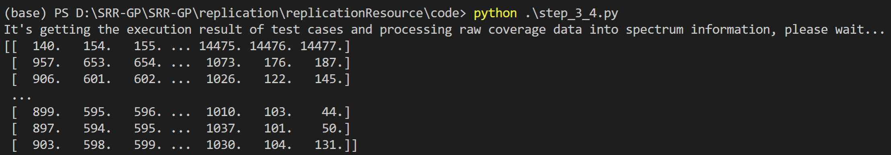
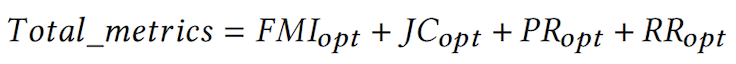
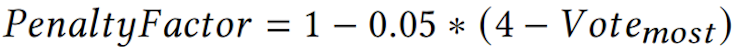

## Installation Instructions

### Prepare Environment for SRR-GP

SRR-GP depends on Python 3 and some necessary libraries. So, please first install Python 3 interpreter and execute the following commands to install the following libraries. 
*(We recommend you to use environment management tools (e.g., conda and virtualenv) to prepare a standalone python environment for SRR-GP).*

```
conda create -n SRR-GP python=3.8
conda activate SRR-GP
pip install xlsxwriter==1.3.8
pip install numpy==1.20.2
pip install xlrd==1.2.0
pip install deap==1.3.1
```

To facilitate the environment construction, we also provide the dependency list file `requirements.txt`. You can execute the following command to install the needed libraries:

```bash
pip install -r requirements.txt
```

*Once the above installation is ready, you should be able to replicate our experiment by the following steps.*


## Usage Instruction

### Step 1: Preparation.

* First, clone the replication package from github.

```shell
git clone https://github.com/yisongy/SRR-GP.git
```

* Second, go to the source code directory **[`replication/replicationResource/code`](replication/replicationResource/code)**.

```shell
cd replication/replicationResource/code
```

### Step 2: Produce the initial population.

* Run **[`step_2.py`](replication/replicationResource/code/step_2.py)**, the script will call `initialGeneration()`, which will generate a file named **[`InitialFormula.xlsx`](replication/replicationResource/code/output/InitialFormula.xlsx)** in the  **[output](replication/replicationResource/code/output/)** folder. This file saves the individuals of the population in the form of string (l1, l2, l3, and l4 represent $N_{CS}$, $N_{CF}$, $N_{US}$, and $N_{UF}$, respectively).

```shell
python step_2.py
```

* The expected output looks like this:

| Num  | Individuals in string format |
| ---- | :--------------------------- |
| 1    | sub(abs(l3), pow(l3, l1))    |
| 2    | add(l4, l2)                  |
| 3    | abs(abs(l3))                 |


### Step 3: Get the execution result, coverage information, and spectrum of test cases.

#### Prepare datasets:

* First, go to the dataset directory to get the source code and all mutants of the programs under test.

```shell
cd replication/replicationResource/dataset
```

* Second, use the mutants provided in  `AllMutants (*benchmark program's name*).xls`, as well as the innocent C programs, to generate multi-fault versions (simulated scenarios).

    Take `AllMutants (flex).xls` as an example. Each line records the mutation we generated, including  `line_number` (line number of mutation), `orig` (the original statement), and `mutated` (the statement after mutation).

| mutant_id | line_number | orig                    | mutated                     |
| --------- | ----------- | ----------------------- | --------------------------- |
| 9         | 3644        | mkdata( base[i] );      | mkdata( base[i] * 0 );      |
| 82        | 2603        | fwd[newec] = i;         | fwd[0 * newec] = i;         |
| 112       | 3499        | int accnum = accset[k]; | int accnum = accset[1 + k]; |

* Third, use the folder `allFaults` we provide in each Java benchmark to generate multi-fault versions (real-world scenarios).

  Take **[`Chart-2bug.json`](replication/replicationResource/dataset/D4J/Chart/allFaults/Chart-2bug.json)**: Chart11b-Chart12b as an example, it contains information about how this 2-bug faulty version is generated (The `.pkl` file is the code coverage. And `failing_tests` and `faulty_components` are the observed failures and the fault location, respectively).

```json
"Chart11b-Chart12b": {
    "coverage": "/home/Defects4J/data/Chart-11b-12b.pkl",
    "failing_tests": {
        "Chart11b": "/home/Defects4J/resources/failing_tests/Chart/11",
        "Chart12b": "/home/Defects4J/resources/failing_tests/Chart/12"
    },
    "faulty_components": {
        "Chart11b": "/home/Defects4J/resources/faulty_methods/Chart/11",
        "Chart12b": "/home/Defects4J/resources/faulty_methods/Chart/12"
    },
    "faulty_components_level": 0
}
```

#### A toy example:

*Since it takes a lot of time to obtain all the datasets, we put a multi-fault version to the folder **[`replication/replicationResource/dataset/Example/flex-A03-A12`](replication/replicationResource/dataset/Example/flex-A03-A12)** (a multi-fault version of C benchmark *flex*) as an example to let readers quickly understand how to use the code.*

* Run **[`step_3_4.py`](replication/replicationResource/code/step_3_4.py)**, the script will use the module **[`getExeResult.py`](replication/replicationResource/code/exp/getExeResult.py)** and **[`getSpectrum.py`](replication/replicationResource/code/exp/getSpectrum.py)**, they will summarize the execution result of test cases (i.e., passed or failed), and process raw coverage data into spectrum information that can be fed into REF/EFF.
```shell
python step_3_4.py
```
* If all the dependencies and paths are properly configured, you will see the following terminal output:

* And failed test cases represented by ranking lists will be saved in the folder **[`flex-A03-A12/rank_mat`](replication/replicationResource/dataset/Example/flex-A03-A12/rank_mat/)**, which can be used to calculate the distance between ranking lists and cluster failed test cases.

### **Step 4: Create the fitness function.**

* The designed fitness function in this paper is sophisticated, thus it would be a little bit complicated if it appears in a simple running example. For a smooth understanding and an easy replication, we give a simplified version, i.e., evalSymbReg(), to complete the whole workflow. 
* The expected outputs are as follows:
    * **[`flex-A03-A12/EuclideanCsv`](replication/replicationResource/dataset/Example/flex-A03-A12/EuclideanCsv/)** which contains the euclidean distance between rankings.
    * **[`flex-A03-A12/clusterAssment`](replication/replicationResource/dataset/Example/flex-A03-A12/clusterAssment/)** which contains the data for calculating the fitness value.

### **Step 5: Get the next generation and iterate.**

* Run **[`step_5.py`](replication/replicationResource/code/step_5.py)**
```shell
python step_5.py
```
* The script will import **[`getMetrics.py`](replication/replicationResource/code/exp/getMetrics.py)** to measure the outcome of clustering results based on the predefined metrics. In the experiment of the paper, the fitness scores of all formulas in a generation need to be calculated. For a concise example, we just give a simple illustration to show how the fitness score can be calculated.

* The process of calculating fitness scores is as follows: read the file **[`OTH11_gp19_metric.xls`](replication/replicationResource/dataset/Example/flex-A03-A12/clusterAssment/metric/OTH11_gp19_metric.xls)** generated in step 4 (different formulas will generate different files. Only formula GP19 is taken as an example here). The contents of this file are as follows：

| Metric |   01   |     10     | 
| ------ | ------ | ---------- |
| FMI    |  0.57  |  **0.82**  | 
| JC     |  0.41  |  **0.73**  | 
| PR     |  0.40  |  **1.00**  | 
| RR     |  0.21  |  **0.79**  | 

* In order to solve the *virtual mapping problem* (refer to section 3.2.1 and section 3.2.2 of the paper), we get the optimal value of each metric, that is, FMI = 0.82, JC = 0.73, PR = 1, and RR = 0.79, and the sum of these four is the Total_metrics.

  
  <!--  -->

* Then set the PenaltyFactor. The method to calculate PenaltyFactor is as follows:

  
  <!--  -->

* For this example, Vote_most is the maximum number of votes obtained by the permutation "01" and "10", i.e., 4. Thus, the value of PenaltyFactor can be calculated as 1, and the fitness score of GP19 is Total_metrics * PenaltyFactor = 3.34. The fitness scores of the formulas in the initial population can be calculated in the same way, thus it is not provided here due to the limited space.

* If users intend to calculate the fitness score of other formulas, please refer to function evalSymbReg() in **[`registration.py`](replication/replicationResource/code/exp/registration.py)**, where we only take the formula GP19 as an example to explain the calculation process. Users can refer to the implementation of GP19 to make the function evalSymbReg() available for other formulas.

* **[`step_5.py`](replication/replicationResource/code/step_5.py)** will import **[`select.py`](replication/replicationResource/code/exp/select.py)**  to determine which individuals as the parents in the population and import **[`getNextGeneration.py`](replication/replicationResource/code/exp/getNextGeneration.py)** to conduct the operations of crossover, copy, or mutation, to deliver the next generation. The output will be saved as **[`NextGenerationFormula.xlsx`](replication/replicationResource/code/output/NextGenerationFormula.xlsx)** in the **[output](replication/replicationResource/code/output/)** folder.


---

***Return to [README](README.md)***

