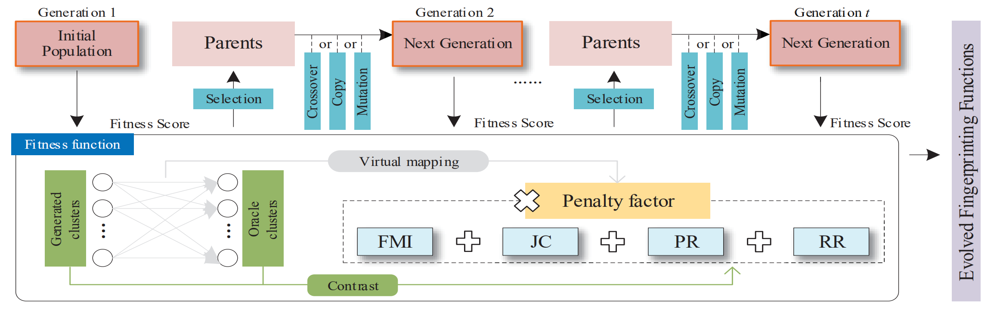
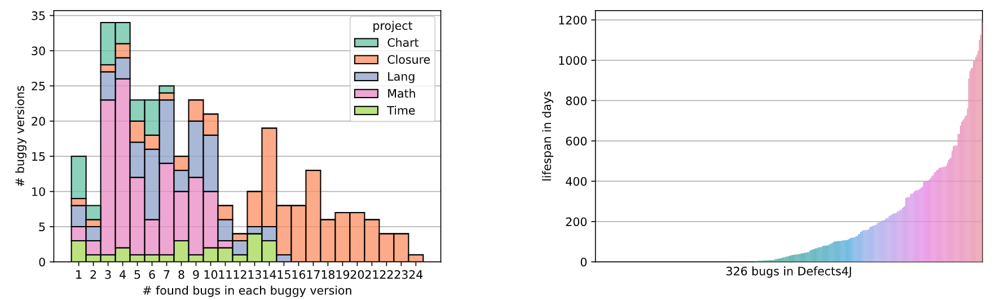
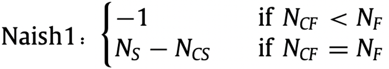
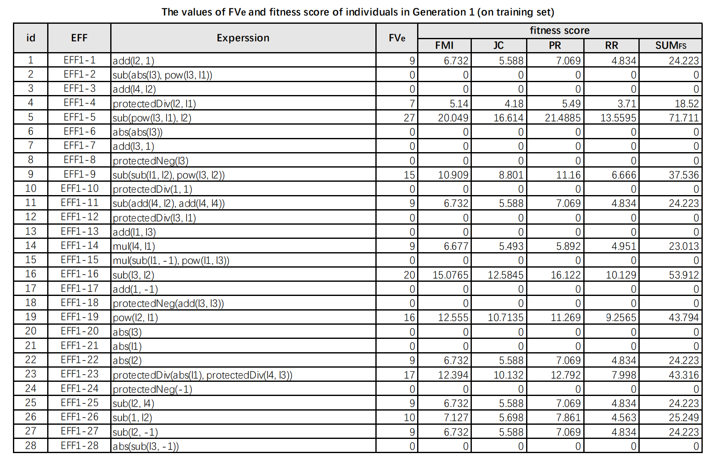
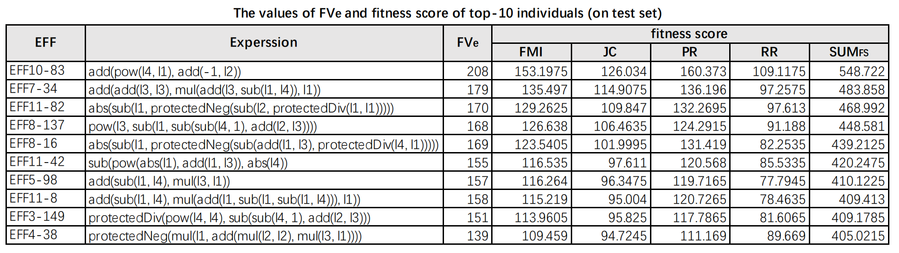
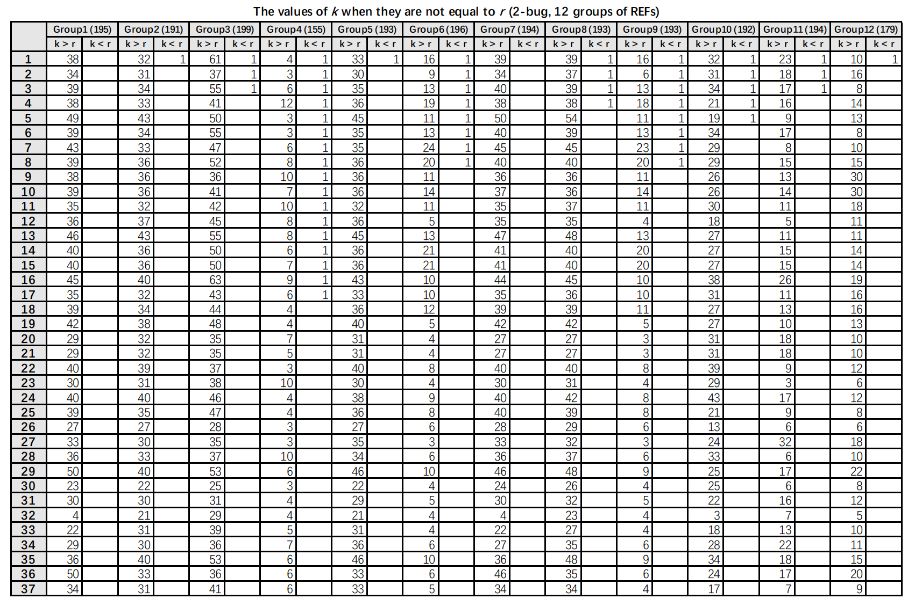

# Artifact for the Paper "Evolving Ranking-Based Failure Proximities for Better Clustering in Fault Isolation"

This is the artifact for the ASE 2022 research paper "***Evolving Ranking-Based Failure Proximities for Better Clustering in Fault Isolation***". This artifact supplies the replication package (the code, the benchmark, and the instruction for replicating our experiments) and the supplementary material (formulas' expression, fitness score, and deviation) of the paper.

## Content
[1 Project Summary](#1-project-summary)<br>[2 Project Structure](#2-project-structure)<br>[3 Framework](#3-Framework)<br>[4 Experiment](#4-Experiment)<br>&ensp;&ensp;[4.1 Our Dataset](#41-our-dataset)<br>&ensp;&ensp;[4.2 Products and Baselines](#42-products-and-baselines)<br>&ensp;&ensp;[4.3 Usage Instruction](#43-usage-instruction)<br>&ensp;&ensp;[4.4 Supplementary Material](#44-supplementary-material)<br>

## 1 Project Summary

This ASE 2022 research paper presents a genetic programming-based framework along with a sophisticated fitness function, for evolving risk evaluation formulas with the goal of more properly representing failures in multi-fault scenarios.

## 2 Project Structure

##### The meanings of all subfolders and files in the `replication` directory

The folder `allFormulas` is threefold, including all individuals in each generation along with their fitness scores (in the training phase), the dominant EFFs' fitness scores (in the test phase), and the values of *k* in the scenario of "*k* ≠ *r*".
  + `allData_training.pdf` provides 2400 (160 individuals per generation * 15 generations) individuals' expressions and their fitness scores in the training phase, corresponding to Section 3.3 of the paper.
  + `allData_test.pdf` provides 10 dominant EFFs' expressions and fitness scores in the test phase, corresponding to Table 6 in the paper.
  + `deviation.pdf` provides the values of *k* (the estimated number of faults) when it is not equal to *r* (the number of faults contained in the program), corresponding to Section 6 of the paper.

The folder `replicationResource` is the source code of the proposed evolution framework and the faulty versions used in experiments and empirical evaluation.
  + code/
    + `step_2.py` is an example to complete the operations in step 2 of `INSTALL.md`.
    + `step_3_4.py` is an example to complete the operations in step 3 and step 4 of `INSTALL.md`.
    + `step_5.py` is an example to complete the operations in step 5 of `INSTALL.md`.
    + `output/` involves part of the expected outputs.
    + `exp/`
      * `dependencies.py` lists the modules utilized in the framework.
      * `registration.py` initializes the services of the GP model and configures the evolving operators.
      * `initialPopulation.py` produces the initial population when the evolving process starts.
      * `select.py` performs the selection step to determine parents.
      * `getNextGeneration.py` conducts the operations of crossover, copy, or mutation, to deliver the next generation.
      * `getDeviation.py` measures the bias when the estimated number of clusters *k* and the number of faults *r* are not identical.
      * `getExeResult.py` determines the execution result of test cases (i.e., passed or failed) by comparing the expected and the actual output.
      * `getMetrics.py` measures the outcome of clustering results based on the predefined metrics.
      * `getSpectrum.py` processes raw coverage data into spectrum information that can be fed into REF/EFF.
      * `SBFL_Formulas_baselines.py` lists the source code of existing SBFL risk evaluation formulas.
      * `SBFL_Formulas_evolved.py` lists the source code of the evolved fingerprinting functions.
  + dataset/
    * `SIR/` lists the C benchmark projects used in the experiments and empirical evaluation.
    * `D4J/` lists the JAVA benchmark projects used in the empirical evaluation.
    * `Example/` gives a toy example for an easy replication.

## 3 Framework

##### The overview of the proposed framework is shown as follows:



The mapping relationship between the modules in the framework and the source code is as follows:

`Initial Population` : **[dependencies.py](replication/replicationResource/code/exp/dependencies.py)**, **[registration.py](replication/replicationResource/code/exp/registration.py)**, and **[initialPopulation.py](replication/replicationResource/code/exp/initialPopulation.py)** 

`Generated clusters`: **[SBFL_Formulas_baselines.py](replication/replicationResource/code/exp/SBFL_Formulas_baselines.py)**, **[SBFL_Formulas_evolved.py](replication/replicationResource/code/exp/SBFL_Formulas_evolved.py)**, **[getExeResult.py](replication/replicationResource/code/exp/getExeResult.py)**, and **[getSpectrum.py](replication/replicationResource/code/exp/getSpectrum.py)**

`Fitness function`: **[getMetrics.py](replication/replicationResource/code/exp/getMetrics.py)** and **[getDeviation.py](replication/replicationResource/code/exp/getDeviation.py)**

`Selection`: **[select.py](replication/replicationResource/code/exp/select.py)**

`Next Generation`: **[getNextGeneration.py](replication/replicationResource/code/exp/getNextGeneration.py)**

The framework is built upon an existing evolutionary computation framework, **[DEAP](https://github.com/DEAP/deap)**.


# 4 Experiment

##### We provide users with more experiment details and the usage instruction of the experiment codes.

## 4.1 Our Dataset

* Readers can get the C benchmark projects used in the training and evaluation through **[`dataset/SIR`](replication/replicationResource/dataset/SIR)**.
  * We use  four classic projects from SIR (flex, grep, gzip, and sed) as benchmark programs to generate 228 single-bug faulty versions by employing mutation-based strategies.
  * We provide a file `AllMutants (*benchmark program's name*).xls` in each benchmark program's folder, which contains the mutants we generated for the corresponding project. 
  * The python script we use to generate mutants can be downloaded through [Arun-Babu/mutate.py: A simple script to perform mutation testing on c/c++ like programs (github.com)](https://github.com/arun-babu/mutate.py)

* Readers can get the JAVA benchmark projects used in the evaluation through **[`dataset/D4J`](replication/replicationResource/dataset/D4J)**.

  * We employ a recent approach to adapt Defects4J to multi-fault scenarios:

   `"Searching for Multi-Fault Programs in Defects4J", Gabin An, Juyeon Yoon, Shin Yoo, SSBSE 2021`
  
  * The following picture is from their paper, which demonstrates that faults in the D4J benchmark often span multiple commits, thus a "single-fault" version may actually contain more than one fault. 

    

  * For more details regarding the generation of D4J multi-fault versions, please refer to [coinse/Defects4J-multifault: Artifact of "Searching for Multi-Fault Programs in Defects4J", SSBSE 2021 (github.com)](https://github.com/coinse/Defects4J-multifault).

## 4.2 Products and Baselines

We compare EFFs generated by the evolution framework with 12 groups of REFs. The source code of these EFFs and REFs can be obtained through **[`SBFL_Formulas_evolved.py`](replication/replicationResource/code/exp/SBFL_Formulas_evolved.py)** and **[`SBFL_Formulas_baselines.py`](replication/replicationResource/code/exp/SBFL_Formulas_baselines.py)**, respectively.

Take the REF *Naish1* as an example:

 

```python
def ER1_naish1(table_sum, exline):
    ranking = zeros((exline, 3))
    i = 0
    for line in table_sum:
        line = mat(line).flatten().A[0]
        ranking[i, 1] = line[0]

        if line[2] < line[8]:
            ranking[i, 2] = -1
        elif line[2] == line[8]:
            ranking[i, 2] = line[6] - line[1]

        i += 1
    ranking = ranking[ranking[:, 2].argsort()[::-1]]
    for i in range(0, exline):
        ranking[i, 0] = i + 1
    return ranking
```

In the function `ER1_naish1()`, the variable `line` contains the spectrum information of each statement, which serves as the input of these REFs. The meaning of the elements contained in `line` is shown in the following table:

| Elements | Meaning                                                      |
| -------- | ------------------------------------------------------------ |
| line[1]  | $N_{CS}$ (the number of test cases that execute the statement and return the testing result of successful) |
| line[2]  | $N_{CF}$ (the number of test cases that execute the statement and return the testing result of failed) |
| line[3]  | $N_{US}$ (the number of test cases that do not execute the statement and return the testing result of successful) |
| line[4]  | $N_{UF}$ (the number of test cases that do not execute the statement and return the testing result of failed) |
| line[5]  | $N_{C}$ (the number of test cases that execute the statement)   |
| line[6]  | $N_{S}$ (the number of successful test cases)                   |
| line[7]  | $N_{U}$ (the number of test cases that do not execute the statement) |
| line[8]  | $N_{F}$ (the number of failed test cases)                       |
| line[9]  | $N$ (the scale of the test suite)                            |

## 4.3 Usage Instruction

*please refer to **[`INSTALL.md`](INSTALL.md)** for installation instructions* and replicating the experiment in our paper.

## 4.4 Supplementary Material

* Readers can get 2400 (160 individuals per generation * 15 generations) individuals' expressions and their fitness scores in the training phase through **[`allData_training.pdf`](replication/allFormulas/allData_training.pdf)**. The following is a partial display of the contents of the document:

  

* Readers can get 10 dominant EFFs' expressions and fitness scores in the test phase through **[`allData_test.pdf`](replication/allFormulas/allData_test.pdf)**. The contents of the document are as follows:

  

* Readers can get the values of *k* (the estimated number of faults) when it is not equal to *r* (the number of faults contained in the program) through **[`deviation.pdf`](replication/allFormulas/deviation.pdf)**. The following is a partial display of the contents of the document:

  

If you use our paper for academic purposes, please cite it as:
```text
@inproceedings{songASE2022,
  author    = {Yi Song and
             Xiaoyuan Xie and 
             Xihao Zhang and 
             Quanming Liu and
             Ruizhi Gao},
  title     = {Evolving Ranking-Based Failure Proximities for Better Clustering in Fault Isolation},
  booktitle = {2022 37th IEEE/ACM International Conference on Automated Software Engineering (ASE)},
  year      = {2022}
}
```
